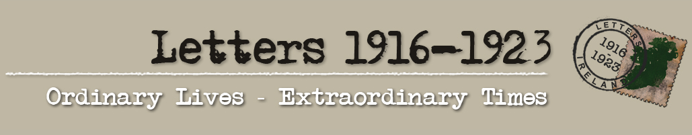
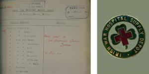
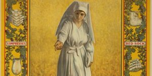
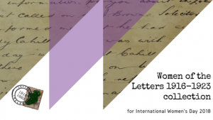
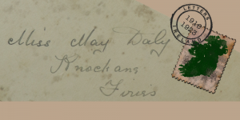
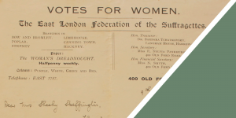
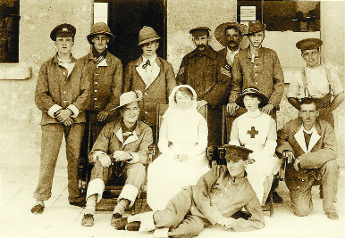

### Women's agency and networks in Ireland (1915-1923)

The visualisations presented here were created by Monika Barget and Susan Schreibman, using metadata and transcriptions from the ["Letters 1916-1923"](http://letters1916.maynoothuniversity.ie/) project. The maps illustrating the development of Irish women's contributions to the British World War I efforts accompany a June 2022 open access publication in the <em>Women's History Review</em>:

<a href="https://www.tandfonline.com/doi/full/10.1080/09612025.2021.2006510">Irish women’s wartime networks: care work and female agency on the first world war home front</a>

<blockquote>This article is a contribution to the growing body of literature that seeks to recover the experience of women on the Irish home front during the Great War. We focus specifically on women who were involved in unpaid wartime supply production and logistics in the vast imperial network of wartime relief crucial to the British war effort. This article draws upon recent scholarship on care work, arguing that the British Expeditionary Force as a micro economy relied on the unpaid labour of women, particularly women of the middle and upper classes, who were prevented by societal norms from participating in paid labour, to ensure the efficient flow of medical supplies. This unpaid work was largely carried out via the Irish War Hospital Supply Organisation (IWHSO), part of a UK-wide network established during the war to furnish troops with medical supplies which could not be met via regular military channels. We argue that this industrialised care work needs to be analysed within the larger context of a professionalisation of private networks and with a view to Ireland’s growing interconnectedness as a result of modernisation.</blockquote>

A more general book chapter on distant reading different women-related corpora of letters in the Letters 1916-1923 collection will appear in the volume <em>Feminist DH</em> co-edited by Susan Schreibman.

Prof. Susan Schreibman (formerly Trinity College Dublin and NUI Maynooth, now Maastricht University) started the Letters 1916-1923 project in 2013.

Since then, circa 6000 letters, telegrams, postcards and notes relating to Irish history between December 1915 and the end of the Civil War in 1923 have been collected from 36 private and 29 public archives.

The initial quantitative analysis of our metadata categories highlighted the [gender ratio per manually assigned tag / topic](https://github.com/MonikaBarget/FeministDH/blob/master/Letters_gender-distribution-per-tag.png) in all items uploaded to the Letters 1916-1923 backend by December 2019.

In this way, we could uncover themes that were [predominantly addressed by women](https://github.com/MonikaBarget/FeministDH/blob/master/Letters_topics-covered-by-women.png).

[Topic modelling](https://monikabarget.github.io/FeministDH/TopicModel_Letters1916-1923.html) helped us compare an automated analysis of the corpus with the tags selected by project members and volunteers when adding items to the collection. This comparison highlighted thematic shifts that occurred as the collection period expanded and raised further questions on the **role(s) of Irish women** from different social and cultural backgrounds. In the time period we are covering, **gender-identity** was inherently linked to what people could or could not do and how they behaved in various social settings. Womanhood, for example, was linked to being a mother (or someone caring for family members more generally), a religious sister, a teacher, or a nurse. In rare cases, women could occupy other professions or become politically active, but even in times of crisis and war, pushing gender boundaries was only socially acceptable if women continued to publicly embrace more traditional roles at the same time. The networking and management responsibilities of the wartime volunteers in the [Irish War Hospital Supply Organisation (IWHSO)](https://monikabarget.github.io/FeministDH/casestudy1.html), for instance, were rooted in traditional concepts of upper class female volunteering and feminine dedication to care. Similarly, the politically aware and outspoken women in the Irish-republican [Charlie Daly network](https://monikabarget.github.io/FeministDH/casestudy2.html) were devoted to family values and religion. Meeting society's expectations and (self-)empowerment often went hand in hand, which makes the analysis of female agency in early 20th-century Ireland particularly challenging and exciting.

***

*Detailed analyses and links to our data:*

[Topic model of 3049 fully transcribed letters](https://monikabarget.github.io/FeministDH/TopicModel_Letters1916-1923.html)

[Case Study 1: the Irish War Hospital Supply Organisation (IWHSO), 1915-1919](https://monikabarget.github.io/FeministDH/casestudy1.html)

[Case Study 2: female correspondents in the Charlie Daly collection from County Kerry, 1922-1923](https://monikabarget.github.io/FeministDH/casestudy2.html)

***

*Selected blog posts on women's stories in the Letters 1916-1923 collection:*

 [**Women in the Irish War Hospital Supply Organisation (1):**](http://letters1916.ie/wp-post/women-in-the-irish-war-hospital-supply-organisation-help-us-uncover-forgotten-stories-of-the-first-world-war-part-1) "The Letters 1916-1923 team collect and publish Irish-themed letters, but we are also actively analysing the life stories of the people whose correspondence we add to our database. At the moment, we are trying to find out more about the volunteers who were involved in the Irish War Hospital Supply Organisation (till spring 1919), helping to produce and ship surgical supplies for military hospitals ..."

***

 [**Women in the Irish War Hospital Supply Organisation (2):**](http://letters1916.ie/wp-post/women-in-the-irish-war-hospital-supply-organisation-help-us-uncover-forgotten-stories-of-the-first-world-war-part-2) "The biographies of women who worked in the Irish War Hospital Supply Organisation are a major research interest of the Letters 1916-1923 team, and we need your help in uncovering these forgotten stories."  

***

 [**International Women's Day 2018:**](http://letters1916.ie/wp-post/iwd-2018) "8th March is International Women's Day and people around the world are celebrating the social, economic, cultural and political achievement of women. To mark the day, we would like to highlight some of the women from the Letters of 1916 collection."  

***

 [**Women in the Daly collection:**](http://letters1916.ie/wp-post/women-daly) "We need your detective skills to help us find out more information about the women in the Daly collection which we recently acquired  from the Kerry Library Archives. We have already processed some of the Daly letters which are available to read and transcribe."  

***

 [**Women's Suffrage in the Letters 1916-1923 collection:**](http://letters1916.ie/wp-post/womens-suffrage) "2018 marked 100 years since Irish women over the age of 30 were granted the right to vote. The Letters 1916-1923 collection contains correspondence relating to the struggle for increased women’s rights and we have chosen some interesting highlights from the collection, e.g. the Sheehy Skeffington Papers."  

***

 [**Women in WW1: Marie Martin:**](http://letters1916.ie/wp-post/women-ww1-marie-martin) "At the height of World War 1 over 375,000 letters were being processed a day and 12.5 million letters left the British home depot every week. During the First World War letters to and from the front served an extremely important purpose. Letters were one of the sole comforts a soldier at the front could count on and their replies reassured those waiting at home..."  

***

[Contact](https://monikabarget.github.io/FeministDH/contact-us.html)

