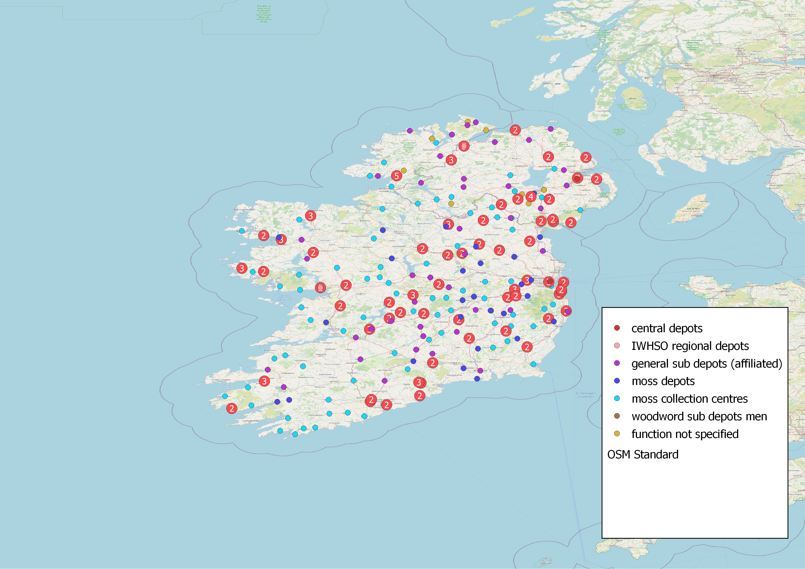

**Case Study 1: the Irish War Hospital Supply Organisation (IWHSO), 1915-1919**

The first case study relates to the *production of medical supplies for war hospitals* in the United Kingdom and abroad, carried out by female volunteers across Ireland. The collection of sphagnum moss used to make wound dressings was an especially important Irish contribution to the British war effort in the First World War.

 Data from the Letters 1916-1923 collection as well as newspaper articles and government reports have been used to map the activities of women's work groups between 1915 and 1919.

The [zoomable map of IWHSO managers in Connacht](https://monikabarget.github.io/FeministDH/IWHSOConnacht_interactive.html) shows centres of medical supply production in the west of Ireland between 1915 and 1917. Please click on individual orange dots to read the labels. All women (and one man) mentioned here were officially part of the Galway branch although some of them came from places in neighbouring counties. One woman counted among the Galway volunteers was stationed in Malta, most likely in a British war hospital.

More **biographical details** (including information from the Irish 1911 census records) are available in the following datasheets:

1. [Women active in 1915/1916 only](https://github.com/MonikaBarget/FeministDH/blob/master/IWHSO-Connacht_bios_women-active-in-1st-period.csv)
1. [Women active in 1917/1918 only](https://github.com/MonikaBarget/FeministDH/blob/master/IWHSO-Connacht_bios_women-active-in-2nd-period.csv)
1. [Women active in both periods](https://github.com/MonikaBarget/FeministDH/blob/master/IWHSO-Connacht_bios_women-active-in-both-periods.csv)

 The [general map](https://monikabarget.github.io/FeministDH/qgis2web_2022_05_27-10_19_09_680795/index.html) is an attempt to display as many medical supply and specialised moss depots in Ireland as possible. This map is an improved and extended version of a [zoomable map of IWHSO depots which Monika Barget and Pádraig MacCarron created at Maynooth University in 2018](https://github.com/MonikaBarget/FeministDH/blob/master/iwhsodepots_1st-map_2018.html). The updated map differentiates the functions of the different local centres further. These functions were mentioned in the official government reports and newspaper coverage of the First World War, but descriptions are used inconsistently. This is partly due to the fact that functions of local work groups changed over time. Some that started off as general depots exclusively collected sphagnum moss later. Another issue is that different centres were called "classes" in the newspapers, not specifying their status within the IWHSO. Additional research is needed to decide what role each of these centres played between 1915 and 1919, and which of the names attributed to them in the various sources were assigned by the government. The maps published here are therefore meant as a starting point for further analysis and discussion. Additions to our data set are always welcome.

**PLEASE NOTE: The point layers in the general map are overlapping, so the ones displayed on top of the list may cover other centres in the same place. Please de(select) individual layers to get a better impression of the dense distribution of centres across Ireland.** 

The [datasheet of all work parties identified so far](https://github.com/MonikaBarget/FeministDH/blob/master/IWHSO_list%20of%20all%20identified%20Irish%20work%20parties%20and%20supply%20depots.csv) provides further information on our sources and doubtful data.

Both web-maps were created using [Python](https://www.python.org/), [QGIS](https://qgis.org/de/site/) and [QGIS2web](https://github.com/tomchadwin/qgis2web). 
    
[HOME](https://monikabarget.github.io/FeministDH/)
