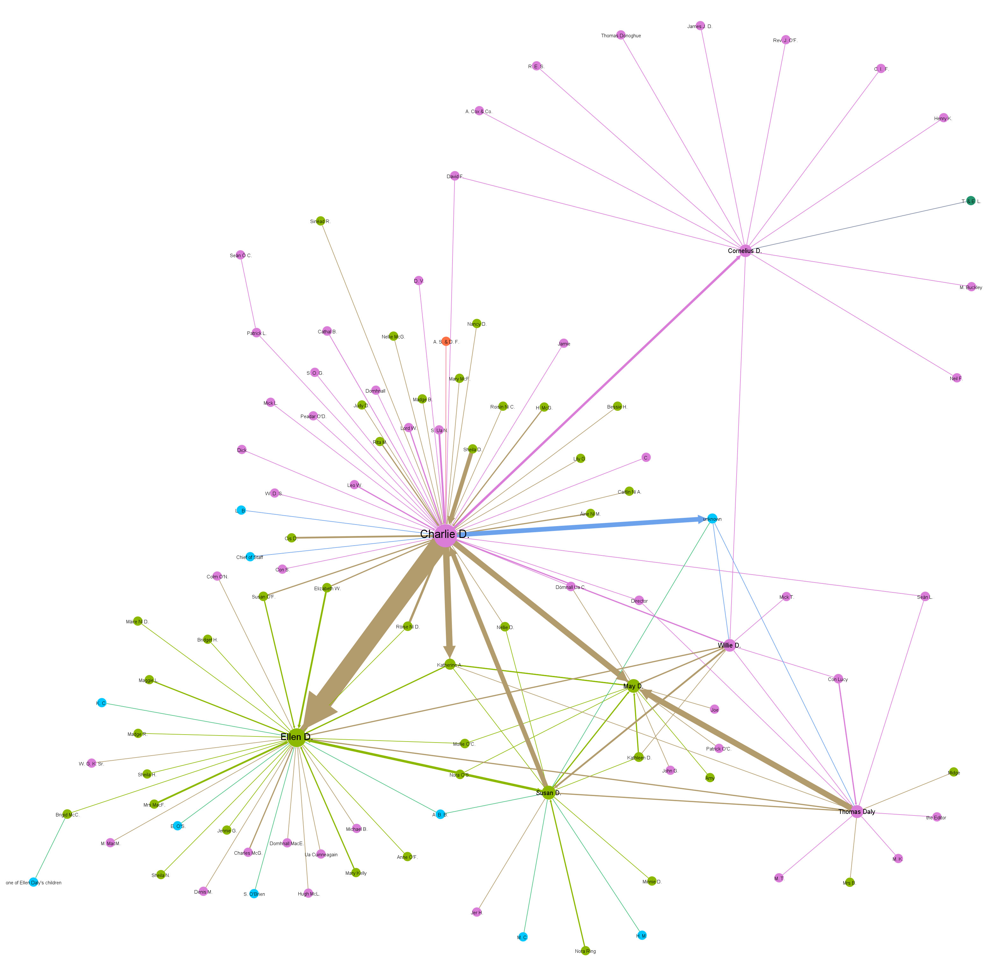

**Case Study 2: female correspondents in the Charlie Daly collection from County Kerry, 1922-1923**

The second case study focusses on the Charlie Daly collection from Co. Kerry, one of Ireland's most important collections of republican correspondence relating to the Civil War (1922-1923).

Almost 50 percent of correspondents in this collection are female, including Charlie Daly's mother, his sisters, female neighbours and family friends like Katherine Allman (Sr. Gertrude).

Topic modelling and network analysis were used to understand the connections between these people and to read their letters in the overall context of social and political change in early-twentieth-century Ireland.

The following network graph shows the Daly family's correspondence network of 288 letters added to Letters 1916-1923 by autumn 2019. Pink nodes are male correspondents, green nodes are female correspondents and blue nodes are correspondents whose gender we could not identify. Other node colours refer to groups of people writing or receiving letters. The edges (connecting lines) stand for the letters exchanged and inherit the colour of the author node. Brown nodes stand for bi-directional correspondence. 

  

Based on this visualisation, we can make the following observations:

1. Charlie Daly and his mother Ellen are the largest nodes, corresponding with both men and women. 
1. Of the letters written by and to Charlie's sister Mary (Máire / May), predominantly those exchanged with Charlie and their brother Thomas have been preserved.
1. Letters from and to Charlie's sister Susan were mainly exchanged with him and their mother. However, Susan also corresponded with people outside the family, including men.
1. The network includes seven letters written by Katherine Allman and 14 received by her. These letters were exchanged with five people: Charlie Daly, Thomas Daly, Ellen Daly, Susan Daly and May Daly.
1. Charlie's brother Cornelius (community in the top right corner) is exclusively connected with men and one married couple. His letters in this network mainly relate to political activities and were exchanged with IRA members / supporters. 

The data (incl. attributes) used to create this network can be consulted in these searchable CSV files:

1. [List of correspondents including name variants and biographical information](https://github.com/MonikaBarget/FeministDH/blob/master/DalyNetwork_nodes_correspondents.csv)
1. [List of 288 letters including dates and Letters 1916-1923 item IDs](https://github.com/MonikaBarget/FeministDH/blob/master/DalyNetwork_edges_letters.csv)

A **topic model** of the Daly letters which have already been described gives insight into the content of the correspondence:

Matching these results with gender, we find that letters which were predominantly written in Irish came from women. Men's letters transcribed so far are more likely to contain occassional phrases in Irish.

[HOME](https://monikabarget.github.io/FeministDH/)
