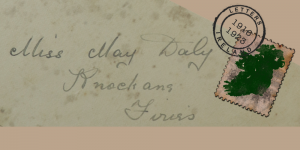

<h3>Related academic publications</h3>

The maps illustrating the development of Irish women's contributions to the British World War I efforts accompany a June 2022 open access publication in the <em>Women's History Review</em>:

<a href="https://www.tandfonline.com/doi/full/10.1080/09612025.2021.2006510">Irish women’s wartime networks: care work and female agency on the first world war home front</a>

<strong>Abstract:</strong>

<em>This article is a contribution to the growing body of literature that seeks to recover the experience of women on the Irish home front during the Great War. We focus specifically on women who were involved in unpaid wartime supply production and logistics in the vast imperial network of wartime relief crucial to the British war effort. This article draws upon recent scholarship on care work, arguing that the British Expeditionary Force as a micro economy relied on the unpaid labour of women, particularly women of the middle and upper classes, who were prevented by societal norms from participating in paid labour, to ensure the efficient flow of medical supplies. This unpaid work was largely carried out via the Irish War Hospital Supply Organisation (IWHSO), part of a UK-wide network established during the war to furnish troops with medical supplies which could not be met via regular military channels. We argue that this industrialised care work needs to be analysed within the larger context of a professionalisation of private networks and with a view to Ireland’s growing interconnectedness as a result of modernisation.</em>

A more general book chapter on distant reading different women-related corpora of letters in the Letters 1916-1923 collection will appear in the volume <em>Feminist DH</em> co-edited by Susan Schreibman.

<h3>Selected blog posts on women's stories in the Letters 1916-1923 collection</h3>

 <a href="http://letters1916.ie/wp-post/women-in-the-irish-war-hospital-supply-organisation-help-us-uncover-forgotten-stories-of-the-first-world-war-part-1"><strong>Women in the Irish War Hospital Supply Organisation (1):</strong></a> "The Letters 1916-1923 team collect and publish Irish-themed letters, but we are also actively analysing the life stories of the people whose correspondence we add to our database. At the moment, we are trying to find out more about the volunteers who were involved in the Irish War Hospital Supply Organisation (till spring 1919), helping to produce and ship surgical supplies for military hospitals ..."

 <a href="http://letters1916.ie/wp-post/women-in-the-irish-war-hospital-supply-organisation-help-us-uncover-forgotten-stories-of-the-first-world-war-part-2)"><strong>Women in the Irish War Hospital Supply Organisation (2):</strong></a> "The biographies of women who worked in the Irish War Hospital Supply Organisation are a major research interest of the Letters 1916-1923 team, and we need your help in uncovering these forgotten stories."

 <a href="http://letters1916.ie/wp-post/iwd-2018"><strong>International Women's Day 2018:</strong></a> "8th March is International Women's Day and people around the world are celebrating the social, economic, cultural and political achievement of women. To mark the day, we would like to highlight some of the women from the Letters of 1916 collection."

 <a href="http://letters1916.ie/wp-post/women-daly"><strong>Women in the Daly collection:</strong></a> "We need your detective skills to help us find out more information about the women in the Daly collection which we recently acquired  from the Kerry Library Archives. We have already processed some of the Daly letters which are available to read and transcribe."

 <a href="http://letters1916.ie/wp-post/womens-suffrage"><strong>Women's Suffrage in the Letters 1916-1923 collection:</strong></a> "2018 marked 100 years since Irish women over the age of 30 were granted the right to vote. The Letters 1916-1923 collection contains correspondence relating to the struggle for increased women’s rights and we have chosen some interesting highlights from the collection, e.g. the Sheehy Skeffington Papers."

 <a href="http://letters1916.ie/wp-post/women-ww1-marie-martin"><strong>Women in WW1: Marie Martin:</strong></a> "At the height of World War 1 over 375,000 letters were being processed a day and 12.5 million letters left the British home depot every week. During the First World War letters to and from the front served an extremely important purpose. Letters were one of the sole comforts a soldier at the front could count on and their replies reassured those waiting at home..."

